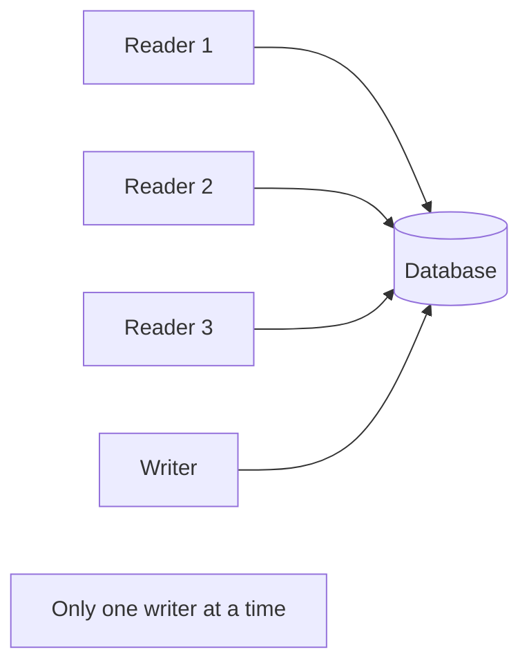

Kuzu supports full ACID transactions. Every query — whether you write it yourself or let Kuzu wrap it automatically — runs inside a transaction.

## ACID guarantees

Kuzu provides the following guarantees for all transactions:

| Property | Guarantee |
|---|---|
| **Atomicity** | A transaction either commits all its changes or leaves the database unchanged. Partial writes never persist. |
| **Consistency** | Transactions move the database from one valid state to another. Constraints are enforced at commit time. |
| **Isolation** | Transactions execute at **serializable** isolation. Each transaction sees a consistent snapshot of the data; concurrent transactions do not interfere. |
| **Durability** | Once a transaction commits, its changes are written to the Write-Ahead Log (WAL) and survive process crashes and restarts. |

---

## Auto-commit mode

Auto-commit is the default mode for every connection. When auto-commit is active, Kuzu automatically wraps each query in its own transaction: the transaction begins before the query runs and commits (or rolls back on error) when the query finishes.

```cypher
-- Each of these statements runs in its own implicit transaction
CREATE (:Person {id: 1, name: "Alice"});
MATCH (p:Person {id: 1}) SET p.name = "Alicia";
MATCH (p:Person) RETURN p.name;
```

You do not need to do anything to use auto-commit. It is active until you explicitly begin a transaction with `BEGIN TRANSACTION`.

---

## Explicit transactions

Use explicit transactions when you need to:

- Group multiple statements into one atomic unit
- Read a consistent snapshot across several queries
- Roll back a partial set of changes on error

### Beginning a transaction

<Tabs>
  <Tab title="Read-write">
    ```cypher
    BEGIN TRANSACTION;
    ```

    Opens a write transaction. You can run both read and write queries inside this transaction.
  </Tab>
  <Tab title="Read-only">
    ```cypher
    BEGIN TRANSACTION READ ONLY;
    ```

    Opens a read-only transaction. Write queries inside this transaction raise an error. Use read-only transactions when you want a consistent snapshot across multiple read queries without blocking writes from other connections.
  </Tab>
</Tabs>

### Committing and rolling back

```cypher
BEGIN TRANSACTION;
CREATE (:Person {id: 2, name: "Bob"});
CREATE (:Person {id: 3, name: "Carol"});
COMMIT;
```

```cypher
BEGIN TRANSACTION;
CREATE (:Person {id: 4, name: "Dave"});
-- Something went wrong; undo all changes
ROLLBACK;
```

After a `COMMIT` or `ROLLBACK`, the connection automatically returns to auto-commit mode. The committed or rolled-back transaction is no longer active.

<Note>
  If a connection object is destroyed while a manual transaction is still open, Kuzu automatically rolls back the active transaction.
</Note>

---

## Python API

The Python client exposes transaction control through the `Connection.execute()` method. Use `BEGIN TRANSACTION`, `COMMIT`, and `ROLLBACK` as Cypher strings.

```python
import kuzu

db = kuzu.Database("/path/to/mydb")
conn = kuzu.Connection(db)

try:
    conn.execute("BEGIN TRANSACTION")
    conn.execute("CREATE (:Person {id: 1, name: 'Alice'})")
    conn.execute("CREATE (:Person {id: 2, name: 'Bob'})")
    conn.execute("COMMIT")
except Exception as e:
    conn.execute("ROLLBACK")
    raise
```

For read-only snapshots:

```python
conn.execute("BEGIN TRANSACTION READ ONLY")
result1 = conn.execute("MATCH (p:Person) RETURN count(p)")
result2 = conn.execute("MATCH ()-[r]->() RETURN count(r)")
conn.execute("COMMIT")
# Both queries saw the same consistent snapshot
```

---

## Concurrency model

Kuzu uses a **single-writer, multiple-reader** concurrency model.



- **Multiple read-only transactions** can run concurrently. They do not block each other.
- **Only one write transaction** can be active at any time. Attempting to start a second write transaction while one is already open raises an error:

  ```
  Cannot start a new write transaction in the system.
  Only one write transaction at a time is allowed in the system.
  ```

- **A write transaction and read transactions** can coexist. Readers see the state of the database as of their transaction start timestamp; they are not affected by concurrent writes until those writes commit.

<Tip>
  For read-heavy workloads where you need to maximize read throughput, open the database in `read_only=True` mode. Multiple processes can then open the same database path simultaneously.
</Tip>

---

## Transaction types

Internally, Kuzu distinguishes the following transaction types:

| Type | Description |
|---|---|
| `READ_ONLY` | Reads the committed state of the database. Cannot perform writes. |
| `WRITE` | Reads and writes data. Only one active at a time. |
| `CHECKPOINT` | Internal type used during checkpointing. |
| `RECOVERY` | Internal type used during WAL replay at startup. |

You interact with `READ_ONLY` and `WRITE` types through `BEGIN TRANSACTION` and `BEGIN TRANSACTION READ ONLY`.

---

## WAL and durability

Every write transaction is logged to the **Write-Ahead Log (WAL)** before it is applied to the main database files. The WAL ensures that committed transactions survive crashes:

<Steps>
  <Step title="Write to WAL">
    When a write transaction commits, Kuzu appends its changes to the WAL on disk before acknowledging the commit.
  </Step>
  <Step title="Apply to storage">
    The changes are applied to the in-memory buffer pool immediately.
  </Step>
  <Step title="Checkpoint">
    Periodically (or manually), Kuzu checkpoints: it merges WAL records into the main database files and resets the WAL.
  </Step>
  <Step title="Recovery">
    On restart after a crash, Kuzu replays any WAL records that were not yet checkpointed, restoring the database to its last committed state.
  </Step>
</Steps>

### WAL replay on startup

When Kuzu opens a persistent database, it checks whether the WAL contains uncommitted records from the previous session and replays them. This process is transparent — you do not need to take any action after a crash.

If WAL replay fails (for example, due to a partially written record), Kuzu raises an error by default. You can disable this behavior with `throw_on_wal_replay_failure=False` to allow recovery up to the point of failure.

<Warning>
  Using `throw_on_wal_replay_failure=False` may result in data loss if records before the failure point are also corrupted. Use this option only for disaster recovery.
</Warning>

---

## Checkpointing

A checkpoint compacts the WAL into the main database files. Kuzu performs checkpoints automatically when the WAL exceeds the configured threshold (default: 16 MB). You can also checkpoint manually:

```cypher
CHECKPOINT;
```

Checkpointing requires that all active transactions finish first. If active transactions do not finish within the checkpoint timeout, the checkpoint raises an error.

<AccordionGroup>
  <Accordion title="Checkpoint behavior during close">
    By default (`force_checkpoint_on_close=True`), Kuzu forces a checkpoint when the database is closed cleanly. This ensures that the next startup does not need to replay a large WAL, keeping startup time short.

    You can disable this with the `force_checkpoint_on_close` setting:

    ```cypher
    CALL force_checkpoint_on_close=false;
    ```
  </Accordion>
  <Accordion title="Tuning checkpoint frequency">
    A lower `checkpoint_threshold` means more frequent checkpoints:

    - Keeps the WAL small, reducing replay time after crashes
    - Increases write amplification for workloads with many small writes

    A higher threshold means less frequent checkpoints:

    - Reduces write amplification
    - Increases WAL replay time after an unclean shutdown

    ```cypher
    -- Set the threshold to 64 MB
    CALL checkpoint_threshold=67108864;
    ```
  </Accordion>
</AccordionGroup>

---

## Error handling and rollbacks

If an error occurs inside a manual transaction, Kuzu rolls back the entire transaction automatically. In auto-commit mode, a failed query has no effect on the database since its transaction is rolled back immediately.

```python
import kuzu

db = kuzu.Database("/path/to/mydb")
conn = kuzu.Connection(db)

conn.execute("BEGIN TRANSACTION")
try:
    conn.execute("CREATE (:Person {id: 1, name: 'Alice'})")
    # This raises an error (duplicate primary key)
    conn.execute("CREATE (:Person {id: 1, name: 'Bob'})")
    conn.execute("COMMIT")
except RuntimeError as e:
    # Roll back to discard the first insert as well
    conn.execute("ROLLBACK")
    print(f"Transaction failed: {e}")
```

<Note>
  After a `ROLLBACK`, the connection returns to auto-commit mode. You need to call `BEGIN TRANSACTION` again to start a new explicit transaction.
</Note>
